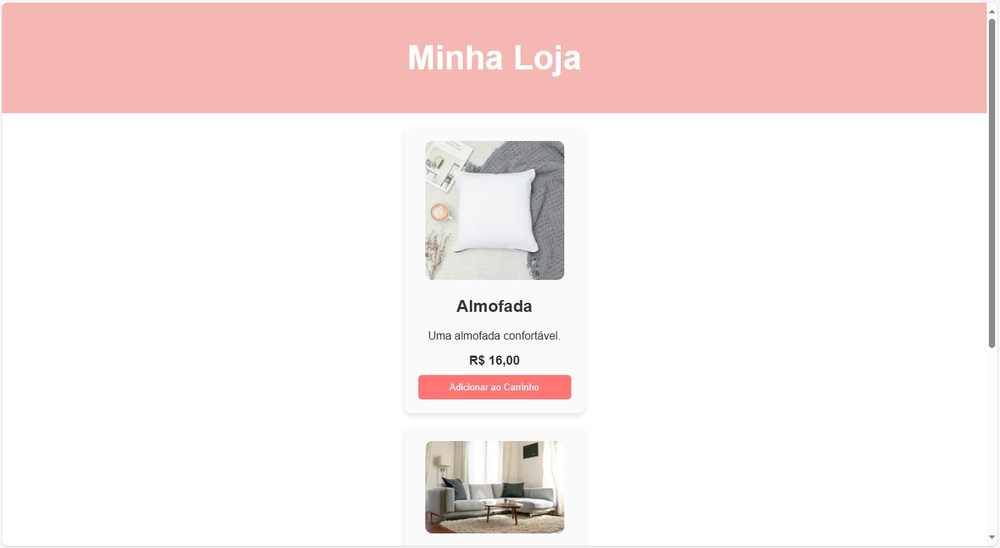
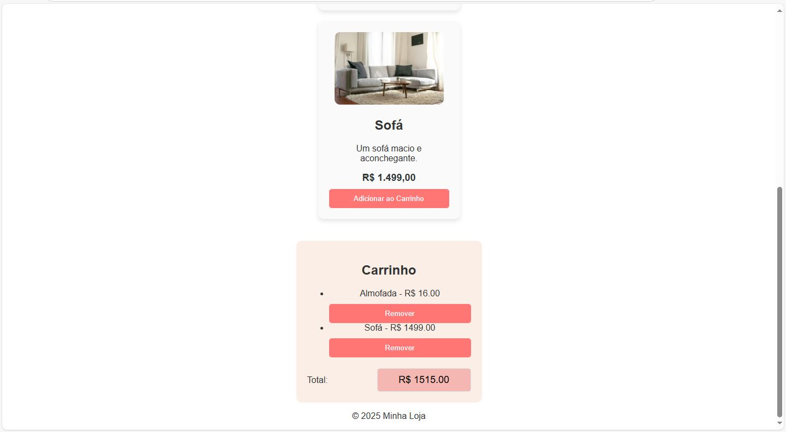

# Mini Catálogo Loja Virtual

Este é um projeto de um catálogo de loja virtual desenvolvido com HTML, CSS e JavaScript. O objetivo do projeto é criar uma interface simples e funcional onde os usuários podem visualizar produtos, adicionar ao carrinho, remover itens e realizar outras interações.

## Funcionalidades

### 1. **Exibição de Produtos**
O catálogo exibe uma lista de produtos disponíveis para compra. Cada produto é exibido com informações como:
- Nome
- Descrição
- Preço
- Imagem

### 2. **Adicionar ao Carrinho**
Os usuários podem adicionar produtos ao carrinho de compras. Para isso, basta clicar no botão "Adicionar ao Carrinho" ao lado de cada produto. O produto será adicionado ao carrinho, e a quantidade será atualizada.

### 3. **Visualizar Carrinho**
O carrinho de compras exibe todos os produtos que foram adicionados. Ele mostra o nome, a quantidade e o preço total de cada item. O total geral também é exibido.

### 4. **Remover Produto do Carrinho**
Os usuários podem remover produtos do carrinho a qualquer momento. Basta clicar no ícone de remoção ao lado de cada produto no carrinho.

### 5. **Finalizar Compra**
Embora o processo de finalização de compra ainda não esteja implementado, o objetivo futuro é permitir que os usuários finalizem a compra com informações de pagamento.

### 6. **Atualizar Quantidade**
Os usuários podem aumentar ou diminuir a quantidade de um produto diretamente no carrinho. O preço total é atualizado conforme as alterações.

### 7. **Interface Responsiva**
O projeto foi desenvolvido para ser responsivo, ou seja, ele funciona bem em dispositivos de diferentes tamanhos, incluindo desktops, tablets e smartphones.

## Como Usar

1. Clone este repositório para o seu computador:
   ```bash
   git clone https://github.com/leonardoaqnn/loja-virtual-front-end.git
   ```

2. Abra o arquivo `index.html` em seu navegador.

3. Navegue pela página para explorar as funcionalidades do catálogo de produtos.

## Prints da Tela Inicial

Aqui estão algumas capturas de tela do projeto:

### Tela Inicial



### Carrinho de Compras


## Tecnologias Usadas

- **HTML**: Estrutura básica da página web.
- **CSS**: Estilo e layout da página, incluindo a responsividade.
- **JavaScript**: Funcionalidade do catálogo, carrinho de compras, e interações do usuário.

## Contribuições

Se você deseja contribuir com este projeto, sinta-se à vontade para criar um pull request. Caso tenha sugestões ou melhorias, fique à vontade para abrir uma **issue**.

## Licença

Este projeto está licenciado sob a [MIT License](LICENSE).
